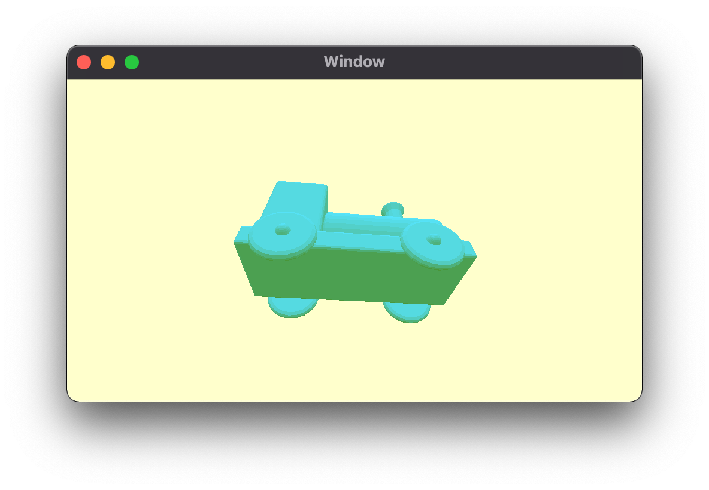

# Chapter 5: Lighting Fundamentals

As I read this book, I summarize what I think is wrong. If you think my comments are wrong then please let me know. We can dicuss more and update your opinion.

## Hemispheric lighting

* It's not make sense at all because the normal vector is in the object space. This book mentioned that `if the normals face up, they'll be blue; if they face down, they'll be green` but even you rotate the train to change the normals face up, the color never be changed. I guess it's showing the power of the fragment shader to you so it will be enough to understand that the fragment shader can define final colors. If you want to see the color is changed when you rotate the train, add below code before return in the vertex shader.

```
out.normal = (uniforms.viewMatrix * uniforms.modelMatrix * float4(vertexIn.normal, 0.0)).xyz;
```



## Diffuse reflection

* This book says that `if you scale an object in one direction (non-linearly), then the normals fo the object are no longer orthogonal and this approach won't work`. Yes it's very correct and you can fix this issue very easily. The normal matrix is that the inversed transposed model matrix. You can read more detail at [here](https://paroj.github.io/gltut/Illumination/Tut09%20Normal%20Transformation.html). Also this sample code already has the implementation to calculate the normal matrix. You can easily get the normal matrix like below.

```
// uniforms.normalMatrix = uniforms.modelMatrix.upperLeft
uniforms.normalMatrix = float3x3(normalFrom4x4: uniforms.modelMatrix)
```
