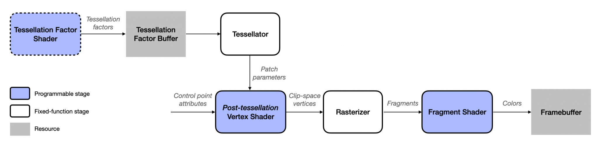

# Chapter 11: Tesellation & Terrains 

As I read this book, I summarize what I think is wrong. If you think my comments are wrong then please let me know. We can dicuss more and update your opinion.

## The starter project

You can more easily understand if you know the tessellation pipeline.



## Metal Performance Shaders

There is the GPU hang issue on Xcode Version 13.3 (13E113). If you faced the GPU hang issue then add this before return a texture in heightToSlope(source:):

```
sleep(1)
```
