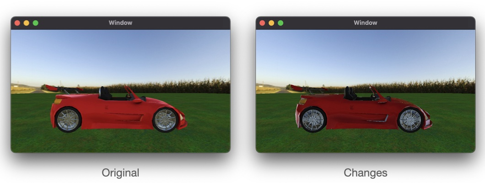
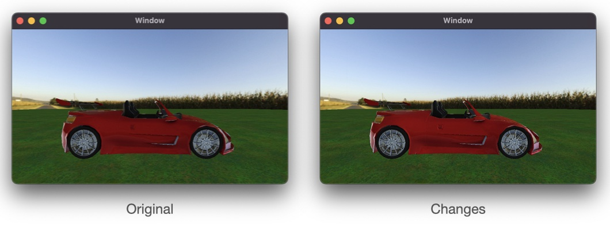

# Chapter 12: Environment

As I read this book, I summarize what I think is wrong. If you think my comments are wrong then please let me know. We can dicuss more and update your opinion.

## The runtime error

A metal shader file isn't included in the bundle so we can't read shader so the runtime error is happened. But a metal shader is compiled and saved as the default library. In Renderer.swift, replace code in `buildPipelineState()`:

```
guard let path = Bundle.main.path(forResource: "Shaders", ofType: "metal") else { return }
let source = try String(contentsOfFile: path, encoding: .utf8)
let library = try device.makeLibrary(source: source, options: nil)
```

to this code:

```
guard let library = device.makeDefaultLibrary() else {
  fatalError("Can't make default library")
}
```

Replace the code after the `// skybox pipeline state`:

```
guard let skyboxPath = Bundle.main.path(forResource: "Skybox", ofType: "metal") else { return }
let skyboxSource = try String(contentsOfFile: skyboxPath, encoding: .utf8)
let skyboxLibrary = try device.makeLibrary(source: skyboxSource, options: nil)

descriptor.vertexFunction = skyboxLibrary.makeFunction(name: "vertex_skybox")
descriptor.fragmentFunction = skyboxLibrary.makeFunction(name: "fragment_skybox")
```

to this code:

```
descriptor.vertexFunction = library.makeFunction(name: "vertex_skybox")
descriptor.fragmentFunction = library.makeFunction(name: "fragment_skybox")
```

## Reflection

In `Skybox.swift`, after creating `update(renderEncoder:)`, you have to comment out this in `render(renderEncoder:uniforms:)`:

```
renderEncoder.setVertexBytes(&viewProjectionMatrix, length: MemoryLayout<float4x4>.stride, index: 1)
// renderEncoder.setFragmentTexture(texture, index: Int(BufferIndexSkybox.rawValue))
let submesh = mesh.submeshes[0]
```

Because this function call is redundant. If a different texture is used, your texture binding state which is done by `update(renderEncoder:)` is overrided by `render(renderEncoder:uniforms:)`.

## Fresnel reflectance

This book doesn't follow the law of conservation of energy. Depending on the surface, the energy can be absorbed when the light hit the surface. Thus we should take care of this if we don't care about this then the surface will be brighter than real.

In IBL.metal, before the begin of fragment_IBL, add the following:

```
float3 fresnelSchlick(float3 n, float3 v, float3 f0) {
    return f0 + (1.0 - f0) * pow(1.0 - max(dot(n, v), 0.0), 5.0);
}
```

This function tells you how much the energy is absorbed.

Replace added code with the following:

```
float3 N = normal;
float3 V = normalize(fragmentUniforms.cameraPosition - in.worldPosition);
float3 F0 = mix(float3(0.04), baseColor, metallic);
float3 F = fresnelSchlick(N, V, F0);
float3 irradiance = skyboxDiffuse.sample(textureSampler, normal).rgb;
float3 diffuse = irradiance * baseColor;
float3 R = reflect(V, N);
constexpr sampler s(filter::linear, mip_filter::linear);
float3 environment = skybox.sample(s, R, level(roughness * 10)).rgb;
float2 BRDF = brdfLut.sample(s, float2(roughness, max(dot(N, V), 0.0))).rg;
float3 specular = environment * (F * BRDF.r + BRDF.y);
float4 color = float4((1.0 - F) * diffuse + specular, 1);
color *= ambientOcclusion;
return color;
```



The car color become more darker than original because you follow the law of conservation of energy.

You don't have to know below because it's out of scope IBL. If you want to know how to interact with lights then it will help you. This book already have explained about PBR in Chapter 7: Maps and Materials. So if you write down PBR in your shader then you can make the better result. Only one thing we need to do is that calculate the final color with lights based on PBR.

In IBL.metal, before the begin of fragment_IBL, add the following:

```
float distributionGGX(float3 n, float3 h, float a) {
    float noh = max(dot(n, h), 0.0);
    return (a * a) / (M_PI_F * pow(noh * noh * (a * a - 1.0) + 1.0, 2.0));
}

float geometrySchlickGGX(float3 n, float3 v, float k) {
    float nov = max(dot(n, v), 0.0);
    return nov / (nov * (1 - k) + k);
}

float geometrySmith(float3 n, float3 v, float3 l, float k) {
    return geometrySchlickGGX(n, v, k) * geometrySchlickGGX(n, l, k);
}
```

Add an uniform of lights to the parameter list for fragment_IBL

```
constant Light *lights [[buffer(BufferIndexLights)]]
```

Add this before return:


```
float3 Ol = float3(0.0);
for (uint i = 0; i != fragmentUniforms.lightCount; ++i) {
  float3 L = normalize(lights[i].position);
  float3 H = normalize(V + L);
  float  D = distributionGGX(N, H, roughness);
  float  G = geometrySmith(N, V, L, pow(roughness + 1.0, 2.0) / 8.0);
  float3 F = fresnelSchlick(H, V, F0);
  float3 Od = (1.0 - F) * baseColor / M_PI_F;
  float3 Os = D * F * G / (4 * max(dot(V, N), 0.0) * max(dot(L, N), 0.0) + 0.001);
  float3 radiance = lights[i].color * lights[i].intensity;
  Ol += (Od + Os) * radiance * max(dot(N, L), 0.0);
}
```

In Renderer.swift, in draw(in view:), locale // render models, add this just before the scene.renderables for loop:

```
scene.fragmentUniforms.lightCount = UInt32(lights.count)
```



Can you see the difference? If you can't see any difference then change light's properties in Lighting.swift. For example, replace `light.intensity = 0.6` with the following:

```
light.intensity = 2.4
```

