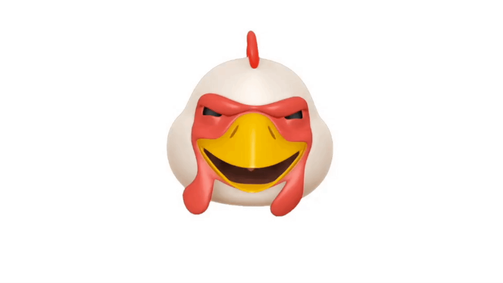

# Chapter 13: Instancing & Procedural Generation

As I read this book, I summarize what I think is wrong. If you think my comments are wrong then please let me know. We can dicuss more and update your opinion.

## Morphing

Morphing which is explaned by this book isn't the cannonical way of morphing. Morphing is usually a morphable mesh where primitives’ attributes are obtained by adding the original attributes to a weighted sum of targets attributes.


For instance, the the position of vertices for the primitive at index i are computed in this way:

```
primitives[i].attributes.POSITION + 
  weights[0] * primitives[i].targets[0].POSITION +
  weights[1] * primitives[i].targets[1].POSITION +
  weights[2] * primitives[i].targets[2].POSITION + ...
```

Apple's animoji is the most famous example of morphing.



## Miscalculation of the world position

In Nature.metal and Houses.metal, the world position is calculated incorrectly, replace:

```
out.worldPosition = (uniforms.modelMatrix * vertexIn.position
                        * instance.modelMatrix).xyz;
```

With:

```
out.worldPosition = (uniforms.modelMatrix * instance.modelMatrix
                        * vertexIn.position).xyz;
```

The result isn't changed because the world position is not used anywhere.