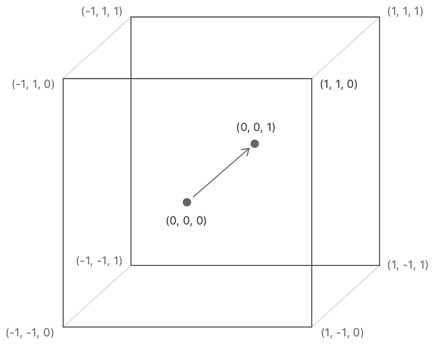
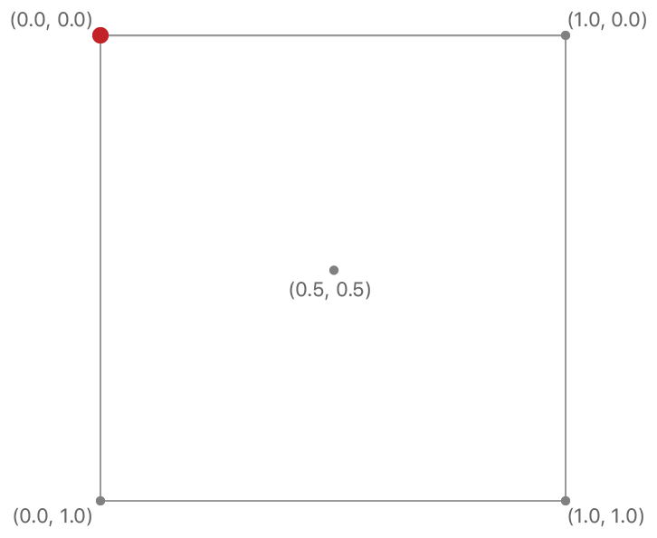

# Chapter 14: Multipass & Deferred Rendering

As I read this book, I summarize what I think is wrong. If you think my comments are wrong then please let me know. We can dicuss more and update your opinion.

## The main pass

You've reserved the Y coordinate since it's upside down. But why? Because the Y coordinate of the normalized device coordinates and texture coordinates is opposite.



This is the normalized device coordinates and you can see the Y coordinate is upward.



This is the texture coordinates and you can see the Y coordinate is downward.

## The Blit Command Encoder

This example uses view's bounds size as the drawable size in Renderer.swift but it's right only the content scale is 1. If your system uses HDPI then your system will use the bigger content scale than 1. It can be 2 or 3 depends on your monitor's resolution. In a nutshell view's bounds size can be different from the drawable size when the content scale is not 1. For example the content scale is 2 and view's bounds size is 512x512 then the drawable size would be 1024x1024. This different can make a runtime error.

In init(metalView:), replace:

```
mtkView(metalView, drawableSizeWillChange: metalView.bounds.size)
```

With:

```
mtkView(metalView, drawableSizeWillChange: metalView.drawableSize)
```

## The G-buffer pass

We use a texture to save the world position. But we don't have to store this information. We can calculate the world position in the composition pass with the inverse view projection matrix and the depth value pass.

In Composition.metal, add the fragment function:

```
fragment float4 compositionFragWithoutPosition(VertexOut in [[stage_in]],
                                               constant FragmentUniforms& fragmentUniforms [[buffer(3)]],
                                               constant Light *lightBuffer [[buffer(2)]],
                                               texture2d<float> albedoTexture [[texture(0)]],
                                               texture2d<float> normalTexture [[texture(1)]],
                                               depth2d<float> depthTexture [[texture(5)]]) {
  constexpr sampler s(min_filter::linear, mag_filter::linear);
  float4 albedo = albedoTexture.sample(s, in.texCoords);
  float3 normal = normalTexture.sample(s, in.texCoords).xyz;
  
  float4 positionInNdc;
  positionInNdc.xy = in.texCoords * 2.0 - 1.0;
  positionInNdc.y = positionInNdc.y * -1.0;
  positionInNdc.z = depthTexture.sample(s, in.texCoords);
  positionInNdc.w = 1.0;

  float4 positionInWorldSpace = fragmentUniforms.inverseViewProjectionMatrix * positionInNdc;
  positionInWorldSpace /= positionInWorldSpace.w;
  
  float3 position = positionInWorldSpace.xyz;
  float3 baseColor = albedo.rgb;
  float3 diffuseColor = compositeLighting(normal, position, fragmentUniforms, lightBuffer, baseColor);
  float shadow = albedo.a;
  if (shadow > 0) {
    diffuseColor *= 0.5;
  }
  return float4(diffuseColor, 1);
}

```

This shader isn't perfect but you can understand how to calculate the world position.

In Renderer.swift, in buildCompositionPipelineState, replace:

```
descriptor.fragmentFunction = Renderer.library.makeFunction(name: "compositionFrag")
```

With:

```
descriptor.fragmentFunction = Renderer.library.makeFunction(name: "compositionFragWithoutPosition")
```

In Common.h, add two variables at FragmentUniforms:

```
matrix_float4x4 viewProjectionMatrix;
matrix_float4x4 inverseViewProjectionMatrix;
```

In renderCompositionPass(renderEncoder:), call these methods before draw:

```
fragmentUniforms.viewProjectionMatrix = uniforms.projectionMatrix * uniforms.viewMatrix
fragmentUniforms.inverseViewProjectionMatrix = simd_inverse(fragmentUniforms.viewProjectionMatrix)
renderEncoder.setFragmentBytes(&fragmentUniforms, length: MemoryLayout<FragmentUniforms>.stride, index: 3)
renderEncoder.setFragmentTexture(depthTexture, index: 5)
```

Instead of saving the position, we can save other valuable information and also can save the memory bandwidth.


## The Lighting pass

We have created the positions buffer and texture coordinates buffer for the composition pass. But we don't have to create these buffers and also can improve a bit of performance. This technique is [Fullscreen triangle](https://wallisc.github.io/rendering/2021/04/18/Fullscreen-Pass.html).

In Composition.metal, add the vertex function:

```
vertex VertexOut compositionFullscreenTriangle(uint id [[vertex_id]]) {
  VertexOut out;
  
  // Generate clip space position.
  out.position.x = (float)(id / 2) * 4.0 - 1.0;
  out.position.y = (float)(id % 2) * 4.0 - 1.0;
  out.position.z = 0.0;
  out.position.w = 1.0;

  // Generate texture coordinates.
  out.texCoords.x = (float)(id / 2) * 2.0;
  out.texCoords.y = 1.0 - (float)(id % 2) * 2.0;
  
  return out;
}
```

In Renderer.swift, in buildCompositionPipelineState, replace:

```
descriptor.vertexFunction = Renderer.library.makeFunction(name: "compositionVert")
```

With:

```
descriptor.vertexFunction = Renderer.library.makeFunction(name: "compositionFullscreenTriangle")
```
