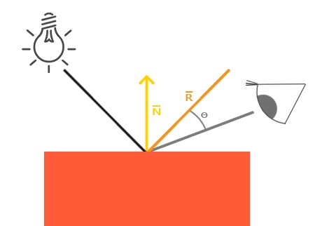

# Chapter 19: Advanced Shadows

As I read this book, I summarize what I think is wrong. If you think my comments are wrong then please let me know. We can dicuss more and update your opinion.

## Hard shadows

There is a runtime error in because Shaders.metal files isn't included in the bundle. But we have the default library.

In Renderer.swift, in initializeMetal(), replace this:

```
guard let path = Bundle.main.path(forResource: "Shaders", ofType: "metal") else { fatalError() }
let input = try String(contentsOfFile: path, encoding: String.Encoding.utf8)
let library = try device.makeLibrary(source: input, options: nil)
```

With:

```
let library = device.makeDefaultLibrary()!
```

## Soft shadows

There is a runtime error in because Shaders.metal files isn't included in the bundle. But we have the default library.

In Renderer.swift, in initializeMetal(), replace this:

```
guard let path = Bundle.main.path(forResource: "Shaders", ofType: "metal") else { fatalError() }
let input = try String(contentsOfFile: path, encoding: String.Encoding.utf8)
let library = try device.makeLibrary(source: input, options: nil)
```

With:

```
let library = device.makeDefaultLibrary()!
```

We have created a new function named lighting() and this function calculates diffuse lighting and specular lighting. But calculating lighting reflection is totally wrong as I think. Specular lighting is based on the light's direction vector and the object's normal vectors, but this time it is also based on the view direction. You can see this below figure.



Thus instead of calculating the intensity between the reflected direction and the light direction, we should deal with the eye position for the specular lighting.

In Shaders.metal, in compute(output, time, gid), replace this:

```
Ray ray = Ray{float3(0.0, 4.0, -12.0), normalize(float3(uv, 1.0))};
```

With:

```
float3 eye = float3(0.0, 4.0, -12.0);
Ray ray = Ray{eye, normalize(float3(uv, 1.0))};
```

In Shaders.metal, in lighting(ray, normal, light), pass the eye position as a paramter:

```
float lighting(Ray ray, float3 normal, Light light, float3 eye)
```

And replace this:

```
float3 reflectedRay = reflect(ray.direction, normal);
float specular = max(0.0, dot(reflectedRay, lightRay));
```

With:

```
float3 reflectedRay = reflect(-lightRay, normal);
float3 eyeDir = normalize(eye - ray.origin);
float specular = max(0.0, dot(reflectedRay, eyeDir));
```

## Ambient occlusion

There is a runtime error in because Shaders.metal files isn't included in the bundle. But we have the default library.

In Renderer.swift, in initializeMetal(), replace this:

```
guard let path = Bundle.main.path(forResource: "Shaders", ofType: "metal") else { fatalError() }
let input = try String(contentsOfFile: path, encoding: String.Encoding.utf8)
let library = try device.makeLibrary(source: input, options: nil)
```

With:

```
let library = device.makeDefaultLibrary()!
```
