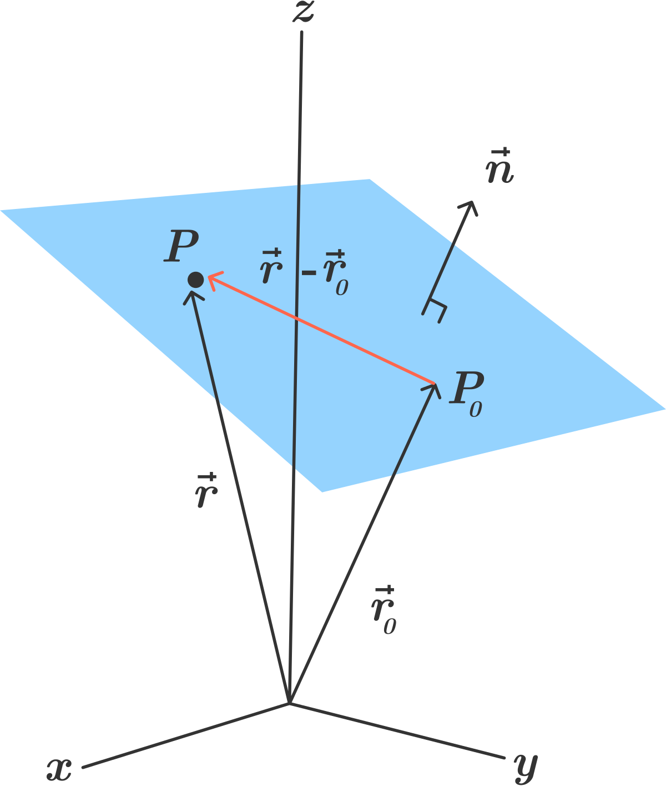
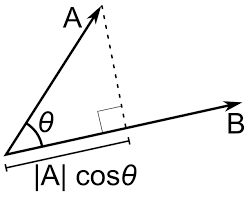

# Chapter 20: Advanced Lighting

As I read this book, I summarize what I think is wrong. If you think my comments are wrong then please let me know. We can dicuss more and update your opinion.

## Getting started

There is a runtime error in because Shaders.metal files isn't included in the bundle. But we have the default library.

In Renderer.swift, in initializeMetal(), replace this:

```
guard let path = Bundle.main.path(forResource: "Shaders", ofType: "metal") else { fatalError() }
let input = try String(contentsOfFile: path, encoding: String.Encoding.utf8)
let library = try device.makeLibrary(source: input, options: nil)
```

With:

```
let library = device.makeDefaultLibrary()!
```

## Drawing a checkerboard pattern

This book explains the different between truncated division and floored division but it's not cinch to understand. Below figure will help you understand easily.


## Refraction

There is a runtime error in because Shaders.metal files isn't included in the bundle. But we have the default library.

In Renderer.swift, in initializeMetal(), replace this:

```
guard let path = Bundle.main.path(forResource: "Shaders", ofType: "metal") else { fatalError() }
let input = try String(contentsOfFile: path, encoding: String.Encoding.utf8)
let library = try device.makeLibrary(source: input, options: nil)
```

With:

```
let library = device.makeDefaultLibrary()!
```

## Raytraced water

There is a runtime error in because Shaders.metal files isn't included in the bundle. But we have the default library.

In Renderer.swift, in initializeMetal(), remove this:

```
let path = Bundle.main.path(forResource: "Shaders", ofType: "metal")
```

Replace this:

```
let input = try String(contentsOfFile: path!, encoding: String.Encoding.utf8)
let library = try device!.makeLibrary(source: input, options: nil)
```

With:

```
let library = device.makeDefaultLibrary()!
```

## 3. Clipping planes

This book uses vector_float4 to define a clip plane without any explanation. The plane consists of the normal of plane and the distance from the origin. From a below figure, we can know the plane can be represented by `ax + by + cz + d = 0`. You can get more detail at [here](https://brilliant.org/wiki/3d-coordinate-geometry-equation-of-a-plane)



Thus float4 is the best type to store the plane. First xyz is the normal and w is distance.

In Renderer.swift, you have added this line in draw(in:) below // Water render:

```
var clipPlane = float4(0, 1, 0, 0.1)
```

Now you can understand what it is. This plane is pointing towards the positive y axis and located at 0.1 on the y axis.

Maybe you can't understand why this book uses dot product for the clip distance. Let's recap the dot product to understand this.



One of the feature of the dot product is projection. From doing dot product between a vertex position and a clip plane, you can know this vertex position is before that plane or after that plane. If a position is located before the plane then the result of dot product is negative. In other case, the result is positive. Now you can easily understand this:

```
vertex_out.clip_distance[0] = dot(uniforms.modelMatrix * vertex_in.position, uniforms.clipPlane);
```
