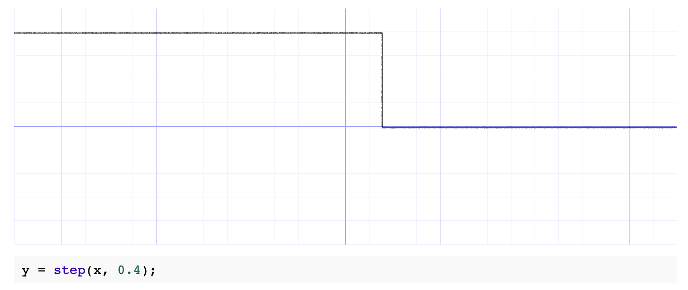

# Chapter 22: Integrating SpriteKit & SceneKit

As I read this book, I summarize what I think is wrong. If you think my comments are wrong then please let me know. We can dicuss more and update your opinion.

## The fwidth function

fwidth() is equivalent to:

```
abs(dfdx(p)) + abs(dfdy(p))
```

The camera position is defined by the constant value in the fragment shader. It's not good because the camera position can be changed.

In Shaders.metal, in shipFragment(), replace:

```
float3 v = normalize(float3(0, 0, 10)); // camera position
```

With:

```
float3 v = normalize(cameraPosition);
```

Add the float3 as a parameter to the fragment function:

```
constant float3 &cameraPosition
```

In GameViewController.swift, in the conditional block where you set up the material, add this:

```
let cameraPosition = cameraNode.position
material.setValue(cameraPosition, forKey: "cameraPosition")
```

step() generates a step function by comparing x to edge:


